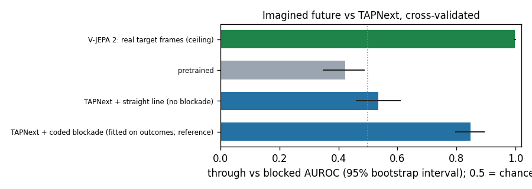

## Results

Through vs blocked AUROC from the imagined future (one ball, frozen decoder), cross-validated (5 folds, seed 0). `auroc_ci`: 95% bootstrap interval over clips. `delta_vs_before_ci` / `p_no_gain`: paired bootstrap against the same variant's pretrained predictor on the same clips (p_no_gain = share of resamples with no gain). TAPNext + coded blockade fits its blockade on outcomes, so it is a reference, not an evaluation. Runs named -long / -frac use the variant picked as best on these same folds, so their numbers are slightly optimistic.

| method | phase | outcome_auroc | auroc_ci | delta_vs_before_ci | p_no_gain | one_ball_p_correct | balanced_accuracy | cell_auroc | argmax_hit_rate | overfit_folds | best_epochs |
|---|---|---|---|---|---|---|---|---|---|---|---|

