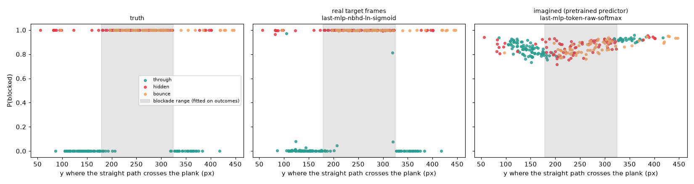
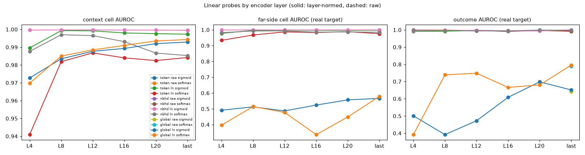
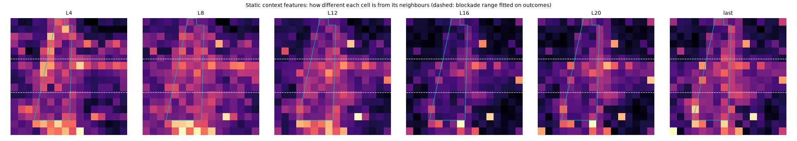
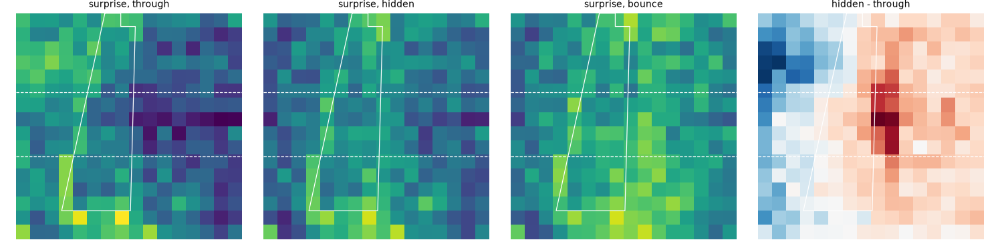
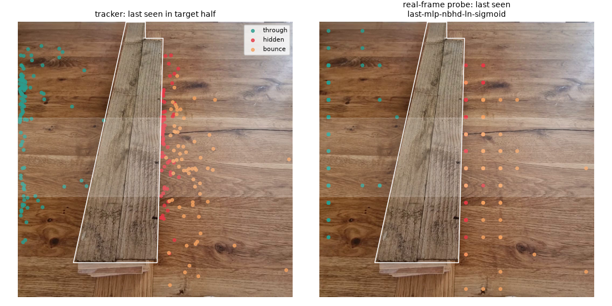

# V-JEPA 2 encoder probing

254 right-segment clips, 5-fold CV (`cv_folds`, seed 0). Every probe is fitted on real context-half features (encoded alone) with same-frame ball cells (`eval_decoder.examples_from`), then scored on held-out clips: context frames, real target frames (far-side cells never had a ball in training) and, for the last layer, the pretrained predictor's imagined target.

## Reference: tracker + rules

| variant | outcome AUROC | P(correct) | balanced acc | tgt cell AUROC | far cell AUROC | hit |
|---|---|---|---|---|---|---|
| continue | 0.539 | 0.333 | 0.333 | 0.597 | 0.814 | 0.227 |
| blockade (blockade fitted on outcomes) | 0.838 | 0.531 | 0.540 | 0.554 | 0.814 | 0.222 |

TAPNext + coded blockade on the earlier 88-clip set: outcome AUROC 0.98 (`docs/results/ball_comparison.md`).

## Factor effects (paired: configs identical except for one factor)

| factor | change | far cell AUROC | outcome AUROC (real) | tgt hit | imag outcome AUROC |
|---|---|---|---|---|---|
| model | mlp - linear | -0.011 (6/12) | -0.057 (8/12) | +0.034 (6/12) | -0.083 (6/12) |
| input | nbhd - token | +0.007 (15/18) | +0.002 (14/18) | -0.005 (4/18) | -0.057 (6/8) |
| input | global - token | -0.480 (0/18) | -0.387 (0/18) | -0.843 (0/18) | -0.099 (2/8) |
| norm | ln - raw | +0.001 (6/12) | -0.000 (5/12) | +0.001 (4/12) | -0.002 (4/12) |
| head | softmax - sigmoid | -0.022 (5/27) | +0.030 (15/27) | -0.047 (3/27) | +0.017 (6/12) |

Each cell: mean change, and how many pairs improved out of all pairs.

## All configs

| config | ctx cell AUROC | tgt cell AUROC | far cell AUROC | tgt hit | far hit | err px | outcome AUROC | P(correct) | imag far cell | imag outcome | imag P(correct, 1 ball) |
|---|---|---|---|---|---|---|---|---|---|---|---|
| L12-linear-nbhd-ln-sigmoid | 1.000 | 0.998 | 0.999 | 0.996 | 1.000 | 19.100 | 0.998 | 0.665 |  |  |  |
| L8-linear-nbhd-ln-sigmoid | 1.000 | 0.997 | 0.999 | 0.999 | 1.000 | 18.400 | 0.996 | 0.704 |  |  |  |
| L16-linear-nbhd-ln-sigmoid | 1.000 | 0.998 | 0.999 | 0.996 | 1.000 | 16.200 | 0.994 | 0.630 |  |  |  |
| L20-linear-nbhd-ln-sigmoid | 1.000 | 0.997 | 0.999 | 0.994 | 1.000 | 16.600 | 0.994 | 0.674 |  |  |  |
| last-linear-nbhd-ln-sigmoid | 1.000 | 0.994 | 0.999 | 0.993 | 1.000 | 16.400 | 1.000 | 0.676 | 0.448 | 0.336 | 0.328 |
| last-linear-nbhd-raw-sigmoid | 1.000 | 0.994 | 0.999 | 0.993 | 1.000 | 16.400 | 1.000 | 0.675 | 0.445 | 0.335 | 0.329 |
| L4-linear-nbhd-ln-sigmoid | 1.000 | 0.998 | 0.999 | 0.997 | 0.996 | 19.700 | 0.995 | 0.663 |  |  |  |
| last-mlp-nbhd-ln-sigmoid | 1.000 | 0.995 | 0.999 | 0.998 | 1.000 | 15.000 | 1.000 | 0.664 | 0.680 | 0.477 | 0.337 |
| last-mlp-nbhd-raw-sigmoid | 1.000 | 0.995 | 0.999 | 0.997 | 1.000 | 15.100 | 1.000 | 0.668 | 0.681 | 0.451 | 0.337 |
| last-mlp-token-ln-sigmoid | 0.999 | 0.959 | 0.999 | 0.999 | 0.998 | 17.400 | 0.997 | 0.611 | 0.653 | 0.405 | 0.330 |
| last-mlp-token-raw-sigmoid | 0.999 | 0.959 | 0.999 | 0.999 | 0.998 | 17.600 | 0.997 | 0.608 | 0.644 | 0.430 | 0.330 |
| L12-linear-token-ln-sigmoid | 0.999 | 0.969 | 0.998 | 1.000 | 1.000 | 16.200 | 0.997 | 0.641 |  |  |  |
| L16-linear-token-ln-sigmoid | 0.998 | 0.961 | 0.997 | 1.000 | 1.000 | 14.700 | 0.990 | 0.646 |  |  |  |
| last-linear-token-ln-sigmoid | 0.997 | 0.942 | 0.997 | 1.000 | 1.000 | 18.600 | 0.991 | 0.650 | 0.497 | 0.321 | 0.332 |
| last-linear-token-raw-sigmoid | 0.997 | 0.942 | 0.997 | 1.000 | 1.000 | 18.500 | 0.991 | 0.647 | 0.497 | 0.334 | 0.332 |
| last-mlp-token-ln-softmax | 0.997 | 0.945 | 0.997 | 0.991 | 0.974 | 25.900 | 0.999 | 0.700 | 0.700 | 0.524 | 0.334 |
| last-mlp-token-raw-softmax | 0.997 | 0.945 | 0.997 | 0.990 | 0.972 | 25.700 | 0.999 | 0.700 | 0.694 | 0.529 | 0.336 |
| last-mlp-nbhd-ln-softmax | 0.999 | 0.988 | 0.997 | 0.990 | 0.990 | 18.500 | 1.000 | 0.690 | 0.659 | 0.228 | 0.305 |
| last-mlp-nbhd-raw-softmax | 0.999 | 0.988 | 0.997 | 0.990 | 0.990 | 18.400 | 1.000 | 0.691 | 0.661 | 0.231 | 0.310 |
| L20-linear-token-ln-sigmoid | 0.998 | 0.929 | 0.996 | 1.000 | 1.000 | 16.900 | 0.997 | 0.661 |  |  |  |
| L8-linear-token-ln-sigmoid | 0.999 | 0.960 | 0.996 | 1.000 | 1.000 | 17.800 | 0.992 | 0.636 |  |  |  |
| L12-linear-nbhd-ln-softmax | 0.997 | 0.985 | 0.993 | 0.981 | 0.994 | 20.200 | 0.994 | 0.586 |  |  |  |
| L8-linear-nbhd-ln-softmax | 0.997 | 0.983 | 0.992 | 0.969 | 0.994 | 20.600 | 0.996 | 0.589 |  |  |  |
| L20-linear-token-ln-softmax | 0.983 | 0.929 | 0.988 | 0.935 | 0.902 | 24.500 | 0.996 | 0.606 |  |  |  |
| L12-linear-token-ln-softmax | 0.987 | 0.937 | 0.987 | 0.979 | 0.984 | 28.600 | 0.996 | 0.635 |  |  |  |
| L20-linear-nbhd-ln-softmax | 0.987 | 0.974 | 0.987 | 0.887 | 0.878 | 24.700 | 0.999 | 0.583 |  |  |  |
| L16-linear-nbhd-ln-softmax | 0.993 | 0.978 | 0.985 | 0.885 | 0.862 | 24.200 | 0.994 | 0.599 |  |  |  |
| last-linear-nbhd-ln-softmax | 0.985 | 0.973 | 0.984 | 0.871 | 0.821 | 24.300 | 0.997 | 0.584 | 0.700 | 0.520 | 0.336 |
| last-linear-nbhd-raw-softmax | 0.985 | 0.972 | 0.984 | 0.855 | 0.825 | 24.900 | 0.997 | 0.574 | 0.696 | 0.523 | 0.336 |
| L16-linear-token-ln-softmax | 0.984 | 0.936 | 0.983 | 0.935 | 0.925 | 26.500 | 0.995 | 0.615 |  |  |  |
| L4-linear-nbhd-ln-softmax | 0.988 | 0.973 | 0.982 | 0.949 | 0.941 | 25.500 | 0.999 | 0.564 |  |  |  |
| L4-linear-token-ln-sigmoid | 0.990 | 0.900 | 0.978 | 1.000 | 1.000 | 16.300 | 0.991 | 0.655 |  |  |  |
| last-linear-token-ln-softmax | 0.984 | 0.915 | 0.976 | 0.837 | 0.731 | 25.300 | 0.993 | 0.562 | 0.671 | 0.505 | 0.334 |
| last-linear-token-raw-softmax | 0.984 | 0.912 | 0.974 | 0.818 | 0.717 | 25.600 | 0.991 | 0.555 | 0.668 | 0.511 | 0.334 |
| L8-linear-token-ln-softmax | 0.982 | 0.900 | 0.967 | 0.962 | 0.986 | 27.300 | 0.998 | 0.616 |  |  |  |
| L4-linear-token-ln-softmax | 0.941 | 0.847 | 0.933 | 0.984 | 0.988 | 22.300 | 0.999 | 0.643 |  |  |  |
| last-linear-global-ln-softmax | 0.994 | 0.785 | 0.579 | 0.243 | 0.000 | 70.500 | 0.796 | 0.298 | 0.457 | 0.397 | 0.326 |
| last-linear-global-raw-softmax | 0.994 | 0.786 | 0.578 | 0.253 | 0.000 | 69.900 | 0.790 | 0.297 | 0.462 | 0.388 | 0.325 |
| last-linear-global-ln-sigmoid | 0.993 | 0.795 | 0.566 | 0.235 | 0.000 | 70.400 | 0.651 | 0.329 | 0.490 | 0.518 | 0.329 |
| last-linear-global-raw-sigmoid | 0.993 | 0.797 | 0.564 | 0.239 | 0.000 | 70.100 | 0.642 | 0.326 | 0.489 | 0.519 | 0.329 |
| L20-linear-global-ln-sigmoid | 0.992 | 0.757 | 0.557 | 0.085 | 0.000 | 105.200 | 0.698 | 0.303 |  |  |  |
| last-mlp-global-raw-softmax | 0.995 | 0.748 | 0.531 | 0.170 | 0.000 | 79.300 | 0.524 | 0.266 | 0.390 | 0.231 | 0.330 |
| last-mlp-global-ln-softmax | 0.995 | 0.748 | 0.530 | 0.163 | 0.000 | 80.000 | 0.521 | 0.268 | 0.392 | 0.226 | 0.330 |
| L16-linear-global-ln-sigmoid | 0.989 | 0.659 | 0.524 | 0.023 | 0.000 | 161.600 | 0.609 | 0.301 |  |  |  |
| L8-linear-global-ln-softmax | 0.985 | 0.559 | 0.514 | 0.028 | 0.000 | 173.900 | 0.739 | 0.329 |  |  |  |
| last-mlp-global-ln-sigmoid | 0.996 | 0.758 | 0.513 | 0.223 | 0.000 | 68.800 | 0.550 | 0.308 | 0.379 | 0.244 | 0.335 |
| last-mlp-global-raw-sigmoid | 0.996 | 0.757 | 0.513 | 0.231 | 0.000 | 68.400 | 0.565 | 0.305 | 0.379 | 0.243 | 0.336 |
| L8-linear-global-ln-sigmoid | 0.984 | 0.574 | 0.512 | 0.045 | 0.000 | 157.200 | 0.392 | 0.337 |  |  |  |
| L4-linear-global-ln-sigmoid | 0.973 | 0.579 | 0.491 | 0.072 | 0.000 | 162.100 | 0.501 | 0.316 |  |  |  |
| L12-linear-global-ln-sigmoid | 0.988 | 0.542 | 0.487 | 0.030 | 0.000 | 146.900 | 0.473 | 0.310 |  |  |  |
| L12-linear-global-ln-softmax | 0.989 | 0.509 | 0.477 | 0.029 | 0.000 | 155.000 | 0.748 | 0.318 |  |  |  |
| L20-linear-global-ln-softmax | 0.994 | 0.729 | 0.449 | 0.102 | 0.000 | 105.000 | 0.680 | 0.291 |  |  |  |
| L4-linear-global-ln-softmax | 0.970 | 0.522 | 0.397 | 0.061 | 0.000 | 204.800 | 0.392 | 0.330 |  |  |  |
| L16-linear-global-ln-softmax | 0.991 | 0.618 | 0.337 | 0.023 | 0.000 | 159.800 | 0.666 | 0.298 |  |  |  |

## Blockade (label-free)

```json
{
 "blockade_range_y": [
  178.8,
  324.9
 ],
 "p_blocked_tgt": {
  "config": "last-mlp-nbhd-ln-sigmoid",
  "auroc_blocked": 0.9999,
  "mean_inside_range": 0.932,
  "mean_outside_range": 0.226
 },
 "p_blocked_img": {
  "config": "last-mlp-token-raw-softmax",
  "auroc_blocked": 0.5293,
  "mean_inside_range": 0.853,
  "mean_outside_range": 0.872
 },
 "distinctiveness": {
  "L4": {
   "plank_in_range": 0.0193,
   "plank_out_of_range": 0.0191,
   "plank_row_profile": [
    0.0247,
    0.026,
    0.0206,
    0.0177,
    0.019,
    0.0183,
    0.0227,
    0.0207,
    0.0206,
    0.0186,
    0.0157,
    0.0173,
    0.0161,
    0.0191,
    null,
    null
   ]
  },
  "L8": {
   "plank_in_range": 0.012,
   "plank_out_of_range": 0.0108,
   "plank_row_profile": [
    0.0108,
    0.0096,
    0.0118,
    0.0113,
    0.0121,
    0.0122,
    0.0132,
    0.0129,
    0.0112,
    0.0119,
    0.0111,
    0.0101,
    0.0111,
    0.01,
    null,
    null
   ]
  },
  "L12": {
   "plank_in_range": 0.0115,
   "plank_out_of_range": 0.0094,
   "plank_row_profile": [
    0.0096,
    0.0089,
    0.0079,
    0.0091,
    0.0096,
    0.0102,
    0.0128,
    0.0133,
    0.0118,
    0.0112,
    0.0104,
    0.0089,
    0.0099,
    0.0102,
    null,
    null
   ]
  },
  "L16": {
   "plank_in_range": 0.0084,
   "plank_out_of_range": 0.0065,
   "plank_row_profile": [
    0.01,
    0.0048,
    0.005,
    0.0058,
    0.0066,
    0.0071,
    0.0094,
    0.0121,
    0.0089,
    0.0075,
    0.0061,
    0.0065,
    0.0065,
    0.0075,
    null,
    null
   ]
  },
  "L20": {
   "plank_in_range": 0.0176,
   "plank_out_of_range": 0.0145,
   "plank_row_profile": [
    0.0217,
    0.01,
    0.0101,
    0.0128,
    0.0151,
    0.0149,
    0.0211,
    0.0235,
    0.018,
    0.0164,
    0.0133,
    0.0149,
    0.014,
    0.0171,
    null,
    null
   ]
  },
  "last": {
   "plank_in_range": 0.0824,
   "plank_out_of_range": 0.072,
   "plank_row_profile": [
    0.0873,
    0.0468,
    0.047,
    0.0681,
    0.0715,
    0.074,
    0.0871,
    0.1002,
    0.0877,
    0.0818,
    0.0671,
    0.0766,
    0.0763,
    0.0837,
    null,
    null
   ]
  }
 },
 "surprise_plank_row_hidden_minus_through": [
  -0.0069,
  0.0069,
  0.0068,
  0.0039,
  0.0012,
  0.0073,
  0.0121,
  0.0158,
  0.0126,
  0.0053,
  0.0077,
  0.0068,
  0.0091,
  0.0023,
  null,
  null
 ]
}
```

## Figures






