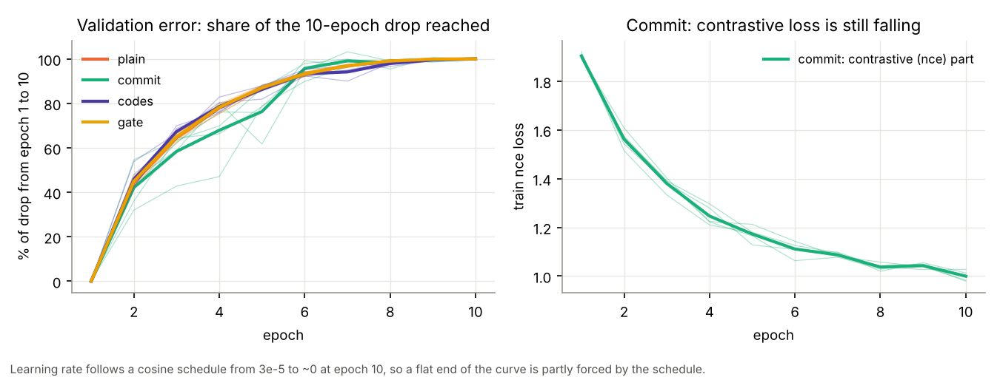
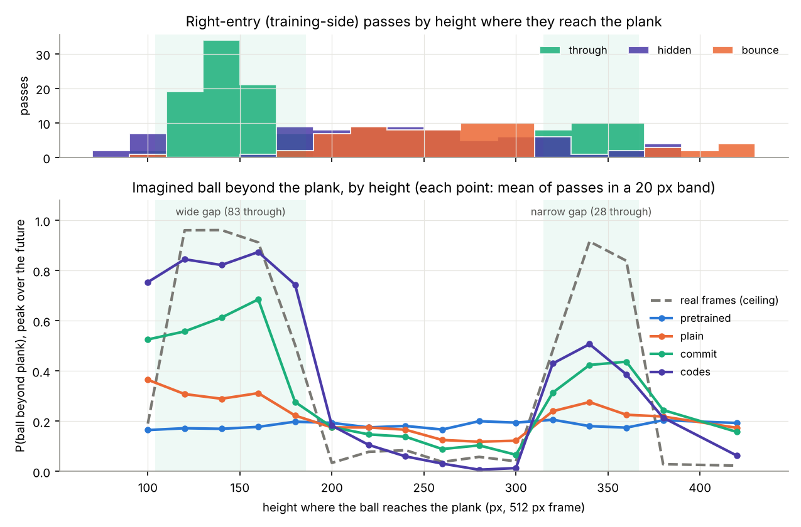
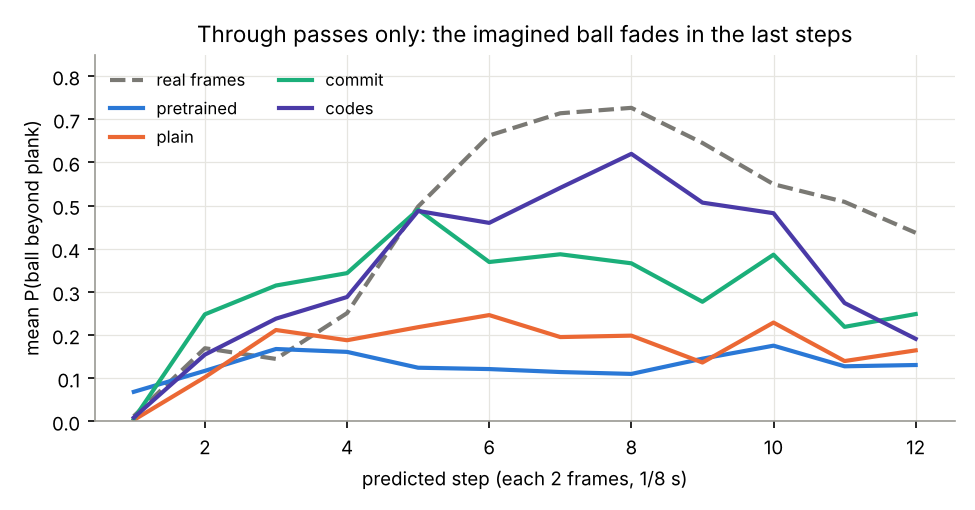
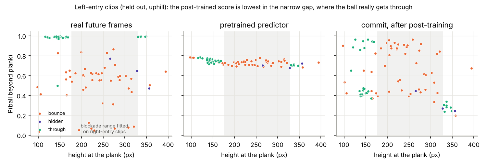

# RobustWorld: next-steps plan (2026-10-09)

Companion to [RESULTS_OVERVIEW.md](RESULTS_OVERVIEW.md). It answers Fin's questions of 2026-10-09
and turns them into a plan sized for Kaggle's free tier: about 30 GPU hours a week, 12-hour
sessions, and roughly 30 minutes of re-encoding at the start of each session.

**Where the numbers come from.** Everything in sections 1–4 is computed from files the Kaggle runs
already saved, so no new GPU time was used. The source is PR #3
(`claude/colab-two-day-plan-3gn90a`, `results/2026-10-04_2110_twoday/vjepa2/plan/`): `train_log.json`,
`per_clip.json`, `blocker/*/crossing.json` and `generalise/*/per_clip.json`. The probing numbers
come from PR #4. Figures are in `figures/plan_*.png`.

**Rule check.** Every score below goes through the frozen `eval_decoder`. Ground truth (tracker
positions and outcomes) is used only to **score** or to **colour** points. Nothing proposed here
fits a readout on predictions or on outcomes. Section 7 flags the one item that needs a change to
`CLAUDE.md`.

---

## 0. Answers in short

| Question | Short answer | Evidence |
|---|---|---|
| Does it need to train longer? | **Probably a little, but not 30 epochs.** Validation error reaches 94–99% of its 10-epoch drop by epoch 7. The "best at epoch 9–10" pattern mostly comes from the learning rate decaying to zero. Commit's contrastive loss is still falling, though, so the cheapest real test is one commit run of 20 epochs, scored every 5 epochs. | §1, `plan_training_curves.png` |
| Can P(ball beyond plank) for through passes go up? | **Yes, and the cause is clear.** An L1 loss predicts the *median* future, so if the model is less than 50% sure a ball will come through, the far side is predicted empty. Three things help: losses that commit to one future (commit already lifts it from 0.30 to 0.55), discrete codes (0.84 in the wide gap), and fixing the fade in the last 4 steps. | §2, `plan_height_profile_right.png`, `plan_through_by_step.png` |
| Narrow gap? | **It is partly learnt (commit 0.42, codes 0.50, real frames 0.92), and the main problem is data.** The wide gap has 83 through passes; the narrow one has 28, with hidden passes inside its edges. Ranked fixes: record ~50 passes aimed at it, self-supervised hard-example sampling, and combining codes with commit. | §2 |
| Mirroring vs the slope? | **Agreed: mirroring is not a fair test.** A mirrored left clip shows a ball rolling "downhill" while slowing down as if going uphill, in a flipped scene. Drop it as a headline. Instead, train on both directions with left clips split across the CV folds. | §3 |
| Score vs height on the left clips? | **The post-trained model has the blockade's shape backwards on the left side.** It gives the lowest "gets through" score in the narrow gap (0.28), where 7 of 8 left balls really do get through, and a high score in the blocked middle (0.69). Real frames show the same two gaps on both sides, so the blocker is the same. | §3, `plan_left_height.png` |
| Table only, no plank (slope)? | Score the imagined ball on the bare table (approach, and bounce-backs) before and after training, uphill vs downhill. The cleanest version needs ~10 min of new no-plank video, which doubles as an interpretability test. | §4 |
| Other-ball data? | **Yes, first as a held-out test.** It needs no training, only encoding and scoring. If the blocker and camera were unchanged, add it to training later for more narrow-gap passes. | §5 |
| Surprise as a score? | A per-height **surprise map** of the plank, before and after training, needs no readout. It is the cleanest label-free picture of where the model thinks the blocker is. It needs one scoring pass that saves per-token errors. | §4 |
| Decoder / adversarial? | Get sharpness from the **predictor**, using an adversarial loss in feature space during post-training. A GAN pixel decoder would draw a sharp ball even when the model is unsure. A display-only pixel decoder trained on real frames is fine, but it needs a change to rule 3. | §6–7 |
| Pick-up eval? | **Yes, but start with a scripted gripper on replayed real ball tracks** (CPU, laptop), driven by each model's imagined future. A learned policy comes later. | §9 |

---

## 1. Training over time: does it need longer?

- **Validation error flattens early.** Averaged over folds, plain, codes and gate reach 93% of
  their 10-epoch improvement by epoch 6, and commit reaches 96%. By epoch 7 it is 94–99%. The
  last three epochs add under 10% (plain 2–4%, commit −3 to +4%, codes 3–10%).
- **"Best epoch 9–10" is mostly the schedule.** The learning rate follows a cosine curve from
  3e-5 to ~0 at epoch 10 (`train_log.json`, `lr` = 2.9e-6, 7e-7, 0 for epochs 8–10). Once the
  steps are that small, the last epoch is almost always the best one, whether or not more training
  would help.
- **Commit's contrastive term is still dropping** (1.90 → 1.00 and still falling at epoch 10).
  That term is what separates futures, and it is the part most tied to the AUROC gain.
- **Caveat.** Validation L1 is dominated by the static background. It can flatten while the ball
  beyond the plank, which is all that matters for the blockade, keeps improving. We have no
  per-epoch AUROC, because only the final checkpoint was scored.

**Run to set up (R1, ~4.5 h):** `commit`, 20 epochs, cosine over 20 epochs, with checkpoints
saved and **scored at epochs 5, 10, 15 and 20**. This is about 3.6 h of training (130 s per epoch
per fold × 5 folds) plus 4 scoring passes. Keep epoch 20 as the pre-registered headline and show
the others as a curve. Picking the epoch by test AUROC would be optimistic. This replaces the
plan's 30-epoch and data-fraction steps, which can stay dropped.

## 2. Through passes: raising P(ball beyond plank), and the narrow gap

Mean imagined P(ball beyond plank), peak over the 12 predicted steps, by the height where the ball
reaches the plank (right-entry clips, each clip scored by the fold that never trained on it):

| model | wide gap (y 104–186, 83 through) | narrow gap (y 315–367, 28 through) | blocked middle (y 186–315) |
|---|---|---|---|
| real frames (ceiling) | 0.95 | 0.92 | 0.06 |
| pretrained | 0.18 | 0.19 | 0.19 |
| plain | 0.30 | 0.25 | 0.15 |
| commit | 0.60 | 0.42 | 0.12 |
| codes | **0.84** | **0.47** | **0.07** |

This corrects one point in the overview. Commit did learn the narrow gap, about half as strongly
as the wide one. **Codes draws the blockade's shape most sharply**, but it also over-predicts
"through" just above the wide gap (y < 104, where the real passes are hidden).

On through passes the real ball beyond the plank peaks at steps 6–8. Commit's imagined ball peaks
at step 5 and then fades. Codes follows reality further but drops at steps 11–12. Through passes
that cross later are weaker for commit (mean 0.65 for crossings at steps 2–3, down to 0.41 at
steps 8–9).

**Why it is low (inferred).** L1 regression predicts the per-feature median. For a pass whose
outcome the model is unsure about, the median far-side token is "no ball" whenever P(through) is
below 0.5. The far-side ball therefore stays faint unless the model is confident. That is why
losses that commit to one future help, and why the rarer narrow gap stays weaker.

**Ways to raise it, cheapest first** (all inside predictor post-training, so all allowed):

1. **Longer commit (R1 above).** Its contrastive loss has not converged.
2. **Codes + commit (R3, new loss option, ~2.5 h).** Snap targets to the codebook as codes does,
   and add commit's InfoNCE term. Codes gives the strongest ball; commit gives the best AUROC
   (0.934 vs 0.911).
3. **Fight the fade.** Give later target steps more weight in the loss, or raise `--motion-alpha`
   (4 → 8) so moving-ball tokens count more. This is a flag change; it costs nothing to set up and
   about 2 h to run.
4. **Feature-space adversarial loss (R5, ~3 h, riskier).** A small discriminator tells real
   target tokens from predicted ones, given the context, during post-training. It pushes the
   predictor to pick one sharp future rather than the average. The discriminator is part of
   training the world model and is thrown away afterwards, so scoring still goes through the frozen
   `eval_decoder` (rule 1 is about readouts). Watch for collapse: the `hyp` multi-hypothesis run
   collapsed with this little data.
5. Rollout (unfinished on PR #3) also targets the fade, but it is the most expensive. It moves
   behind 1–4.

**Narrow gap specifically:**

- **Data (best value).** The wide gap has 83 through passes; the narrow one has 28, with hidden
  passes at y 315–339 overlapping its upper edge. Recording **~50 more passes aimed at the narrow
  gap** (same camera, same blocker) roughly triples its examples. No new labels are needed, because
  it is just more video.
- **Self-supervised hard-example sampling (R4, small code change).** Each epoch, oversample the
  training clips with the highest current loss. Rare narrow-gap passes are the hard ones, so they
  get more weight without the model ever seeing an outcome label.
- **Other-ball clips** add passes too, if the blocker had not moved (§5).
- **Check.** Redraw the height profile for every new run. The narrow-gap column is the number to
  watch.

## 3. The other side, the slope, and what the model actually learnt

The left-entry clips (held out, 83 clips) by height:

| band (y at plank) | real outcomes | real frames | pretrained | plain after | commit after |
|---|---|---|---|---|---|
| wide gap 110–170 | 25 through, 4 bounce | 0.92 | 0.75 | 0.61 | 0.58 |
| middle 170–325 | 39 bounce, 1 hidden | 0.51 | 0.73 | 0.65 | **0.69** |
| narrow gap 325–355 | 7 through, 1 hidden | 0.95 | 0.70 | 0.50 | **0.28** |

- **The blocker is in the same place for both directions.** Left balls also get through only at
  y ≈ 116–168 and 330–349.
- **After post-training, the left-side score has the shape backwards.** Commit's AUROC against
  the height rule is 0.31; against the real outcome it is 0.36. Through passes in the wide gap
  also split into two clusters (~0.9 and ~0.4).
- **Inferred reading.** The narrow gap is the clearest case. There, the post-trained model puts
  the left balls' future ball on the *left* of the plank, which is where training balls at that
  height ended up. Left balls really end up on the right. So the predictor has at least partly
  learnt "at this screen height the ball ends up on that side of the plank", tied to the training
  direction. It has not learnt a blocker that stops a ball coming from either side. This matches
  the layer-patching result (no single layer carries the change) and the change maps (spread over
  the whole image).
- **The slope makes the left side harder, not unfair.** Training balls roll downhill (right to
  left); left balls roll uphill and slow down. Mirroring makes a ball that travels right to left
  but slows down as if it were going uphill, in a flipped scene, so it is out of distribution in
  two ways. **Drop the mirrored number as a test.** Keep it in the record as tried.

**Run to set up (R2, ~3 h): train on both directions.** Run `cv_folds` over all 337 clips (254
right + 83 left), score each side separately, and still compare against the same-fold
pretrained model. To learn a blockade that works from both sides, the model must tie it to the
ball's motion rather than to screen position. The left clips also teach it the uphill
deceleration. Caveat: the left side has only 3 hidden clips, so for the left side report
through vs blocked only.

## 4. Surprise, the bare table, and interpretability

All of these are label-free (rule 5) and use saved weights, so they cost only scoring passes.

**Surprise as a score (S1).** Save each held-out clip's per-token prediction error (12 steps ×
256 tokens in float16 is about 1.5 MB for all clips) for the pretrained model and for each
post-trained run. Then plot:

- *Surprise map of the plank.* Mean error in the far-side exit cells against crossing height,
  shown separately for through and blocked passes, before and after training. The pretrained model
  is surprised by every through pass, because it never expects a ball beyond the plank. A model
  that has learnt the blockade should be unsurprised by through passes in the gaps and unsurprised
  by blocked passes in the band. That makes the blockade visible as a band of low surprise for
  blocked passes, drawn by the model's own error with no readout.
- *Path-matched surprise, after training.* Repeat PR #4's matched pairs (pretrained: hidden
  +0.0037, bounce +0.015 more surprise than matched through passes). If the model learnt the
  blockade, that gap should shrink or flip.
- *Surprise AUROC* (through vs blocked) next to the decoder AUROC. Caveat: surprise needs the real
  future, so it measures "did this match the model's expectation" and is not a forecast. Report it
  as interpretability, not as a replacement headline.

**The bare table, and the slope (S2).** These need no new video:

- Score the imagined ball only on target steps where the real ball is on open table, more than 2
  cells from the plank: the approach, and bounce-backs rolling away.
- Report position error and **signed along-slope velocity error** (does the model think the ball
  goes faster or slower downhill than it really does?), before vs after, downhill (right) vs
  uphill (left) clips.
- The tracker is used only to score, so this is allowed.

The positions come from the frozen `eval_decoder` argmax at each step. `ball_probe_cv` already
computes this (`ball_imagined.error_px`) but only saves the aggregate, so it needs per-step saving.

**Optional new video, ~10 min (best interpretability per minute of effort).** Record **balls
rolling across the table with the plank removed**, in both directions, same camera.

- It is a clean slope test: does the post-trained model predict uphill slowing and downhill
  speeding up?
- It is also a strong memorisation test: if the post-trained model still "blocks" balls at
  y 176–329 when there is no plank, it learnt screen rows, not an object under a plank.

**Shift test (S3, ~40 min).** Re-encode about 100 clips translated by ±32 px (crop and pad) and
re-score. If the predicted blockade band moves with the plank, the model reads the scene. If it
stays at fixed rows, it is positional memorisation. Together with §3, this would settle what was
learnt.

**Attention (S4, ~30 min).** Find which context tokens the far-side target queries attend to,
before vs after. Does attention to the plank rows inside the blockade band rise?

## 5. The other-ball data

- **First, as a held-out test (no training).** Encode it, check the real-frame ceiling (the frozen
  decoder was fitted on the first ball; if the real-frame AUROC drops, the decoder is not finding
  the new ball), then score pretrained vs post-trained. If the post-trained gain carries over, the
  model learnt where the ball stops, not what this ball looks like. Cost is about 30–45 min.
- **Then, possibly, as training data**, but only if the blocker and camera were unchanged. It
  adds passes (especially in the narrow gap) and variety in size and speed. Keep a held-out slice
  of it.
- If the decoder misses the new ball, `eval_decoder` can be refitted on real context-half frames
  of both balls. That is allowed, and it stays frozen across before and after, but earlier numbers
  would then need rescoring for a like-for-like comparison.
- **Need from Fin:** was the blocker in the same place, and the camera unmoved, when it was
  recorded? Roughly how many passes?

## 6. A decoder that shows outcomes, and sharper balls

- **No-training visuals now.** Overlay the frozen `eval_decoder` heatmap of the imagined ball on
  the last context frame for each future step, before vs after, on `data/eval/sample5`. This is
  honest and allowed today.
- **Pixel decoder (display only).** A small conv decoder from V-JEPA features to RGB, trained only
  on real context-half frames and frozen before and after, would render imagined futures as video.
  Fed blurry predicted features, it shows blurry balls, which is the honest picture. Cost is about
  1 h on Kaggle from the cached features. It is never used for scores. **This needs a change to
  `CLAUDE.md` rule 3** ("the only trained readout on V-JEPA features is `eval_decoder`"); see §7.
- **Adversarial: put it in the predictor, not the decoder.** A GAN-trained pixel decoder learns
  to draw a crisp ball from whatever features it gets. It would make an unsure prediction *look*
  confident, which overstates the model. Sharper balls should come from the predictor committing
  to one future (§2, item 4). Then even a plain decoder shows them.

## 7. Choices for Fin

1. **Next Kaggle session = Session 1 below** (commit 20 epochs scored every 5, save the weights,
   then surprise, bare-table and shift scoring)? *Recommended.*
2. **Replace the mirrored test with training on both directions** (R2)? *Recommended.*
3. **Rule 3 amendment.** Allow one display-only pixel decoder, trained on real context-half
   frames, frozen, never scored, and covered by `tests/test_eval_isolation.py`? *Recommended if you
   want video of the predictions; otherwise skip and use the heatmap overlays.*
4. **New recordings:** about 50 passes aimed at the narrow gap, and about 10 min with the plank
   removed (both directions)? *Recommended. These are the highest-value inputs for the narrow gap
   and for the slope.*
5. **Other ball:** same blocker and camera? Then it goes in as a held-out test first.
6. **Pick-up:** start with the scripted replay simulation on the laptop (§9)? *Recommended*,
   rather than training a gripper policy first.

## 8. Compute plan (Kaggle, ~30 GPU h a week)

One change saves most of the future cost: **save the fold predictor weights (fp16) to the Kaggle
output** and reload them in later sessions. At the moment, steps like `interpret` retrain the
folds when the weights are missing, which costs about 2 h each time.

| session | runs | approx. GPU h | answers |
|---|---|---|---|
| **1** | encode (0.5) · R1 commit 20 epochs, scored at 5/10/15/20 (4.5) · save weights · S1 surprise maps (0.5) · S2 bare-table and slope scoring (0.3) · S3 shift test (0.7) | **~6.5** | train longer? · through-pass strength over epochs · surprise blockade map · slope · what was learnt |
| **2** | encode · R2 both directions (3) · R3 codes+commit (2.5) | ~6 | other side with the slope · sharper ball and narrow gap |
| **3** | encode · other-ball held-out scoring (0.7) · R4 hard-example sampling (2.2) · motion-alpha 8 or late-step weighting (2.2) | ~5.5 | other ball · narrow gap |
| 4 (if 1–3 are promising) | R5 feature-space adversarial (3) · pixel decoder if rule 3 is amended (1) · retrain on new narrow-gap and no-plank recordings | ~5 | sharper predictions · video for the write-up |
| laptop (CPU) | pick-up replay simulation (§9) on saved imagined trajectories | 0 GPU | pick-up before vs after |

Every new run gets the height-profile figure (`plan_height_profile_right.png`) and the left-side
plot redrawn automatically. Those two figures show the narrow gap and direction-dependence
directly.

Code changes needed on PR #3 (owned by the "Two-day Colab experiment plan" thread; nothing has
been changed there):

- `posttrain.py`: `--save-every`, a scored-checkpoint list, a `codes+commit` loss, late-step
  weighting, hard-example sampling, and later the adversarial loss.
- Scoring: save per-clip, per-token surprise; save per-step decoded positions; a shift-encode
  option.
- `plan.py`: new steps R1–R4 and S1–S3; save and restore fp16 weights.

---

## 9. Pick-up evaluation: outline (separate track)

**Aim.** Show that a better world model makes a robot better at picking up the ball once it crosses
a line beyond the plank. It should go for balls that will come through, be in the right place in
time, and not waste moves on balls the hidden blocker will stop.

**Should Fin train a gripper in simulation with varied ball positions and speeds?** Yes, as the
later stage. Start without training a policy, so any before/after difference can only come from
the world model.

**P0: define the task (from the existing clips).**

- Pick a catch line beyond the plank. For each clip, the tracker gives either the time and height
  where the ball crosses the line, or "never" (hidden or bounce).
- Decision point: the end of the context half (24 frames, 1.5 s). The robot must act on the world
  model's forecast of the next 1.5 s.

**P1: replay simulation with a scripted gripper (CPU, laptop, about 1–2 days of work).**

- Use a simple MuJoCo or PyBullet scene: a gripper with a speed and acceleration limit that moves
  along the catch line, plus a ball whose motion is **replayed from each held-out clip's real
  track** (slope and blocker included automatically). Nothing has to be rendered to look like
  Fin's table.
- At the decision point, the gripper reads the world model's imagined future through the frozen
  `eval_decoder`: the predicted crossing height and time, and P(ball arrives). Its rule: move
  there if P(arrives) > θ, otherwise stay.
- Every clip is driven by the CV fold that never trained on it.
- Compare these drivers of the same scripted gripper:
  - V-JEPA pretrained;
  - post-trained (commit, codes, and later runs);
  - TAPNext straight line (no blockade);
  - TAPNext + fitted blockade (reference, learns from outcomes);
  - oracle (the real future);
  - reactive (only moves once it sees the ball cross).
- Metrics:
  - pick-up success on through passes;
  - wasted moves on blocked passes;
  - time margin at the catch line;
  - success as a function of θ, so the result is threshold-free like the AUROC.
- **Speed sweep:** vary gripper speed and ball speed (resample real tracks, faster or slower). The
  world model should matter most when the gripper is slow relative to the ball, because there a
  reactive gripper fails and only prediction helps.
- Rule check: the gripper is a fixed rule, nothing is fitted on predictions or outcomes, and the
  tracker only scores.

**P2: learned gripper policy in simulation (CPU, a few hours of PPO).**

- Train a policy on simulated balls whose start positions and speeds are drawn from the real
  track distribution, with the slope modelled. Give the observation the predicted ball state (or
  the decoded heatmaps).
- To keep the evaluation clean, train the policy on simulated or oracle forecasts only, and
  freeze it. At test time, swap in each world model's forecasts. Training the policy on world-model
  predictions against real outcomes would be a readout fitted on predictions (rule 1).
- Report the same metrics as P1; the before/after gap should match P1's.

**P3: imitation from observation (later).**

- Record a short set of videos of a hand picking up the ball after it crosses the line. Learn the
  policy from observed state changes (for example BCO, or keypoint-based IfO), with the world
  model supplying the forecast.
- A real gripper is the step after that, if one is available.

**Compute.** P1 and P2 run on the laptop. The only GPU work is one scoring pass per world model that
saves the decoded imagined trajectories, which can go in Session 1.
