# RobustWorld: results so far (2026-10-08)

**Question.** A ball rolls under a plank. A hidden blocker under the plank stops some passes
("hidden", or "bounce" when the ball comes back). Can V-JEPA 2 learn where the invisible
blocker is, purely by post-training its predictor on our video?

**Short answer so far.** Yes on the training direction, with a caveat. Post-training lifts
through-vs-blocked AUROC from **0.42 (pretrained, below chance) to 0.93** (best objective,
`commit`), beating the hand-coded TAPNext + fitted-blockade reference (0.85). But the same models
get **worse** on balls rolling in from the other side (0.64 → 0.35–0.39), so it is not yet shown
that the model learnt "an object at a place" rather than a one-direction rule.

Sources (all figures here are copies, so they render after `git pull`):
post-training on PR #3 (`claude/colab-two-day-plan-3gn90a` @ `e717d1c`,
`results/2026-10-04_2110_twoday/`), probing on PR #4 (`claude/vjepa-probing-overnight` @ `919d440`,
`results/2026-10-05_0425_vjepa-probing/`), zero-shot on `main` (`docs/results/ball_comparison.md`).

> **Next steps (2026-10-09):** see [NEXT_STEPS_PLAN.md](NEXT_STEPS_PLAN.md) for training length, the narrow gap, the other side and the slope, surprise maps, and the pick-up evaluation outline.

---

## 1. Setup in one paragraph

- **Data:** one fixed-camera recording (`whole.mp4`) cut into 48-frame clips at 16 fps.
  - Training direction: 254 right-entry clips (111 through, 77 hidden, 66 bounce).
  - Held-out other side: 83 left-entry clips (32 through, 48 bounce, only 3 hidden).
- **Model:** V-JEPA 2 ViT-L. Encoder frozen; only the predictor is post-trained (10 epochs, L1 in
  layer-normalised latent space), 5-fold CV (`cv_folds`, seed 0).
- **Scoring (CLAUDE.md rule):** every V-JEPA number is read through the frozen `eval_decoder`.
  It is linear, fitted only on real context-half features with same-frame ball positions. No readout
  ever sees outcomes or predictions.
- **Headline metric:** through-vs-blocked AUROC, from how much ball the imagined future puts beyond
  the plank (one ball assumed; 0.5 = chance). Paired bootstrap of after − before on the same clips.

## 2. Probing: can we read the ball out of V-JEPA at all? (PR #4)

**Yes, near-perfectly, so the readout is not the bottleneck.**

- Any per-token or 3×3 linear probe finds the ball on real frames:
  - context-cell AUROC ≈ 1.000;
  - far-side cells (never seen with a ball in training) 0.996–0.999;
  - median error 14–20 px on a 512 px frame.
- Pooling tokens (global input) fails: far-cell AUROC 0.33–0.58. MLP vs linear, LN vs raw: no
  difference. Sigmoid beats softmax.
- The existing `eval_decoder` (last layer, linear, per token, LN, sigmoid) is within 0.002 of the
  best config. It reads the real outcome at AUROC 0.99–1.00, so the ceiling for an imagined future is ≈1.0.
- It also transfers to the other side on real frames: cell AUROC 0.98, far-cell 0.995, outcome 0.97–1.0.

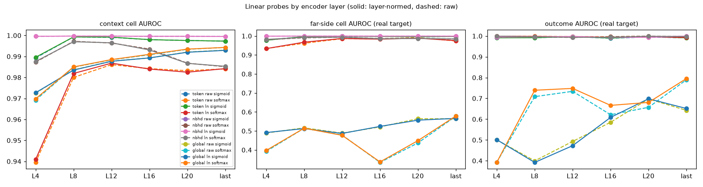
*Per-token / neighbourhood probes (top lines) are ≈1.0 at every layer from L8 up. Pooled
"global" probes (bottom lines) fail on far-side cells.*

**The pretrained predictor knows nothing about the blockade.** Imagined outcome AUROC is
0.23–0.53 across 24 probe configs. It almost never imagines the ball past the plank, so it
effectively "predicts blocked" for every pass.

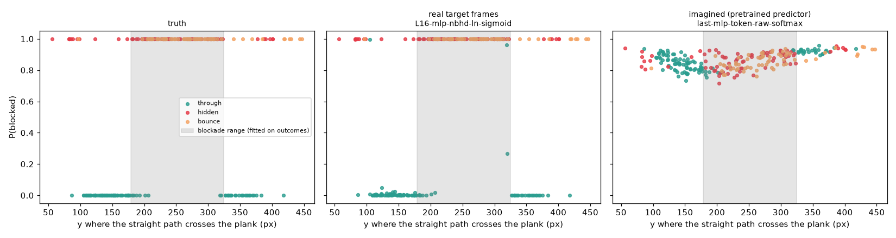
*Middle: real frames separate outcomes perfectly. Right: the pretrained predictor's imagined
P(blocked) is a flat high band whatever the crossing point.*

**Label-free signals:**

- **The blocker did not move during the recording.** The fitted range is 178–320 px in the first
  14 min and 194–325 px in the last 14. The straight-line crossing is off by 21 px on average,
  and about 14% of passes fit no single range, so a ceiling of about 0.85 for any rule-based
  tracker is real.
- **Surprise notices failed passes even before training.** We paired each blocked pass with the
  through pass nearest in path and speed. The pretrained predictor is still more surprised on
  blocked passes: hidden +0.0037 (48/77 pairs, p = 0.003); bounce +0.015 (59/63, p < 0.001).
  Surprise is a valid, readout-free score.
- **The blocker is not visible.** Static token distinctiveness is slightly higher in the
  blockade rows, but the band runs across the whole frame. It is scene structure, not the blocker.

*Pretrained predictor error per cell. Right: hidden − through, highest at the plank's exit
edge in the blockade rows (raw comparison; path-matched numbers above).*

## 3. Post-training: does V-JEPA learn the blockade? (PR #3)

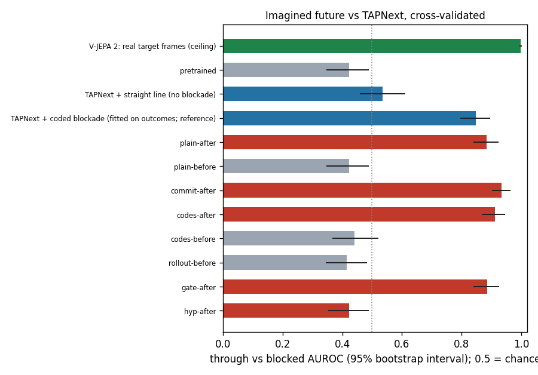

| method | AUROC [95% CI] | gain vs before [95% CI] | far-cell AUROC | ball hit rate | best epochs |
|---|---|---|---|---|---|
| Real target frames (ceiling) | 0.998 [0.995, 1.0] | – | – | – | – |
| Pretrained predictor | 0.422 [0.35, 0.49] | – | – | 0.20 | – |
| TAPNext + straight line | 0.536 [0.46, 0.61] | – | – | – | – |
| TAPNext + coded blockade (fitted on outcomes; reference) | 0.848 [0.80, 0.89] | – | – | – | – |
| **plain** (latent L1) | 0.884 [0.84, 0.92] | +0.38 to +0.54 | – | 0.48 | 10/10/9/10/10 |
| **commit** (motion-weighted L1 + contrast) | **0.934** [0.90, 0.96] | +0.43 to +0.59 | 0.81 | 0.58 | 10/7/10/9/10 |
| **codes** (256-code k-means, cross-entropy) | 0.911 [0.87, 0.94] | +0.38 to +0.56 | 0.71 | 0.46 | 10/10/10/10/9 |
| **gate** (copy-last-frame gate) | 0.885 [0.84, 0.92] | +0.38 to +0.54 | 0.77 | 0.48 | 10/10/9/10/10 |
| **hyp** (multi-hypothesis, winner-takes-all) | 0.423 [0.36, 0.49] | −0.07 to +0.08 (no gain) | 0.54 | 0.23 | 10/3/7/2/1 |

"Before" rows (codes-before 0.44, rollout-before 0.415) match the pretrained model, as they
should. Every successful run's gain CI excludes 0 (`p_no_gain` = 0.0).

### What the best model (commit) actually imagines

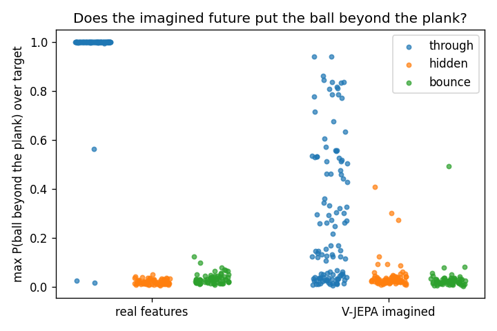
*commit-after. The pretrained predictor shows no ball past the plank for any clip (next figure).
After post-training, about half of the through passes get a clear imagined ball past the plank
(0.2–0.95), while hidden and bounce stay near 0. The other half of the through passes still
look blocked.*

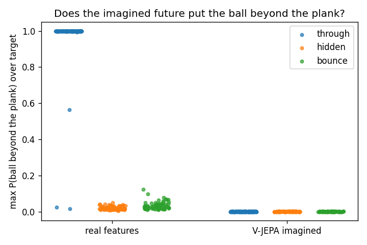

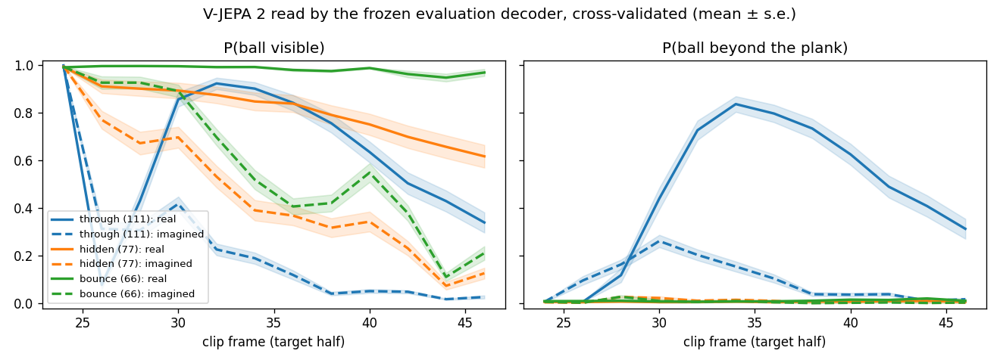
*Dashed = imagined, solid = real. The imagined "ball beyond plank" for through clips peaks at
≈0.26 vs ≈0.84 in reality, and fades early. The prediction is right in direction but faint.*

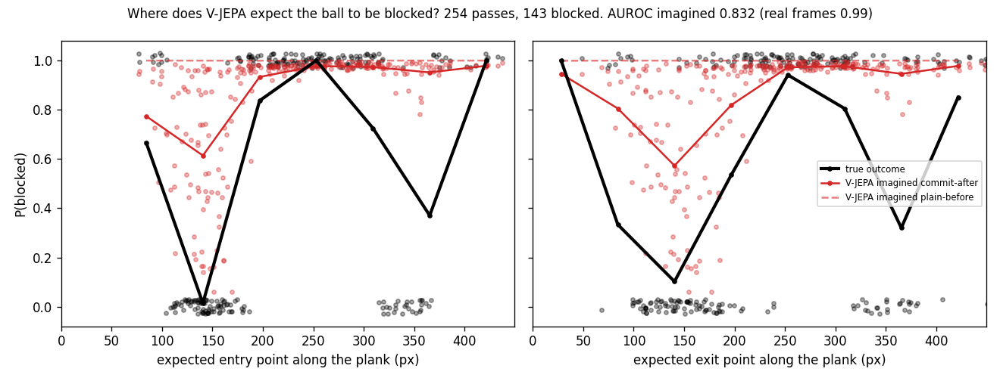
*Black = true outcome rate by crossing point, red = commit-after. There are two "through windows"
along the plank, near 140 px and near 360 px. commit learnt the **upper window only**. Passes
through the lower window are still predicted blocked. (P(blocked) here is the decoder's
normalised probability, so its AUROC is 0.83, not 0.93.)*

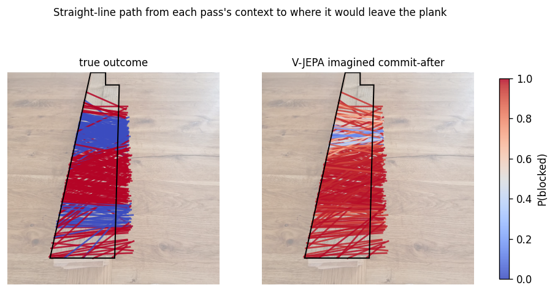
*The same thing on the image: the true map (left) has two blue bands, and the model (right) only
the upper one.*

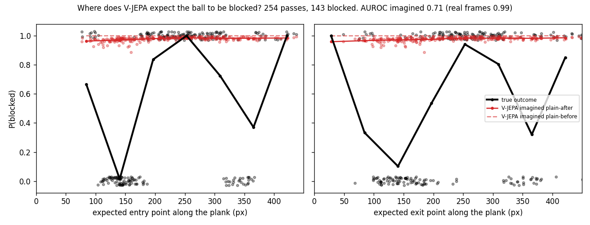
*plain-after for comparison. P(blocked) stays near 1 everywhere: its 0.88 AUROC comes from small
ranking shifts, not a clean "ball comes out" prediction. commit's motion weighting is what
makes the imagined ball visible.*

### Failed variants

- **Copy gate:** no change vs plain (0.885 vs 0.884). The scene was already clean; gating the
  background doesn't free capacity that matters.
- **Multi-hypothesis:** collapsed to pretrained level (0.42), with early best epochs (3/2/1) and
  1/5 folds flagged as overfitting. The imagined ball vanishes for every clip: winner-takes-all
  settled on one "no ball" future.

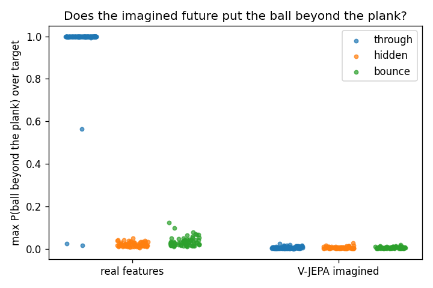

### Where the change sits (interpretation of plain)

- **In the image:** the feature change is spread across the frame. Only 18.8% of it is on the
  plank, which is 17.2% of the frame. For blocked clips, the decoded ball probability rises at
  the plank's entry edge: the model learnt to keep the ball there.
- **In the network:** patching any single layer into the pretrained predictor recovers nothing
  (≤ 0.43). Reverting a single layer hurts most for the embeddings (0.71) and layers 3–4
  (0.75 / 0.69); reverting layers 8–11 costs nothing. So the knowledge is distributed over the
  embeddings and early-to-mid layers, not stored in one place.

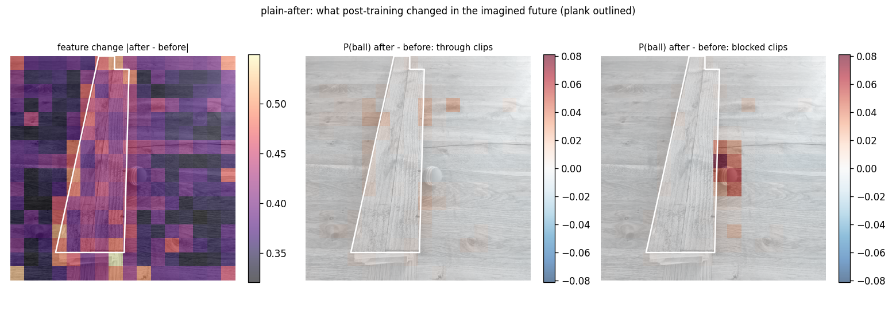
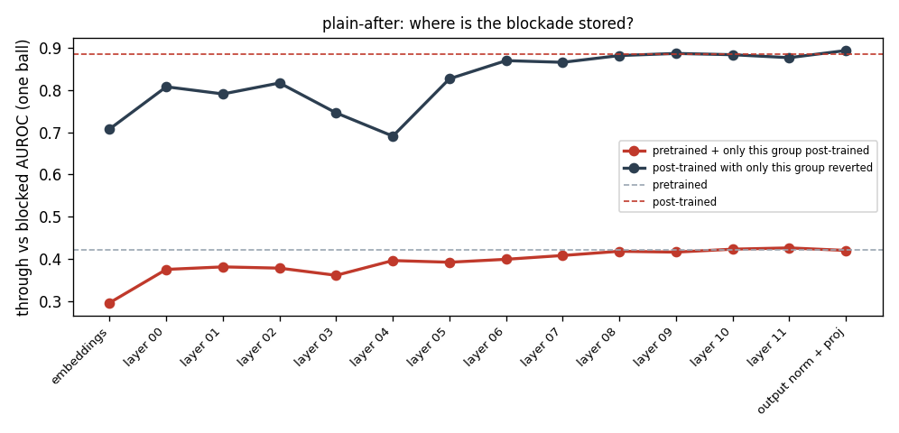

## 4. Generalisation: the other side gets worse

The models never saw left-entry clips during training.

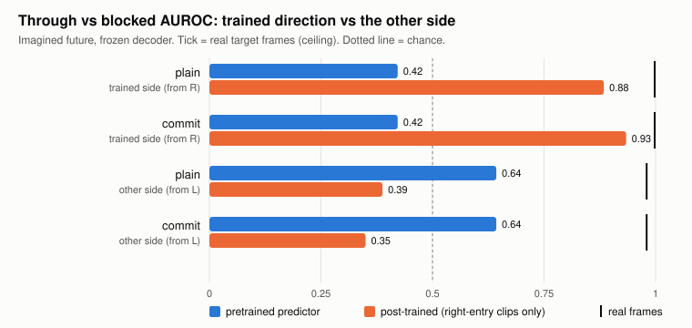

| model | other side: before | after | real frames |
|---|---|---|---|
| plain | 0.643 | **0.388** | 0.98 |
| commit | 0.643 | **0.350** | 0.98 |

Commit's per-outcome detail on the other side:

- **Before training:** every pass imagined about equally far, so everything reads as through.
- **After training:** 23 of 32 through passes are now called blocked. Bounces get *more*
  far-side ball mass than through passes (0.67 vs 0.53), i.e. the ranking is inverted.
- **Caveat on the data:** the left set is mostly bounces (48 bounce, 3 hidden), so it is a
  different outcome mix from training.

## 5. Zero-shot baselines (main, older 88-clip set)

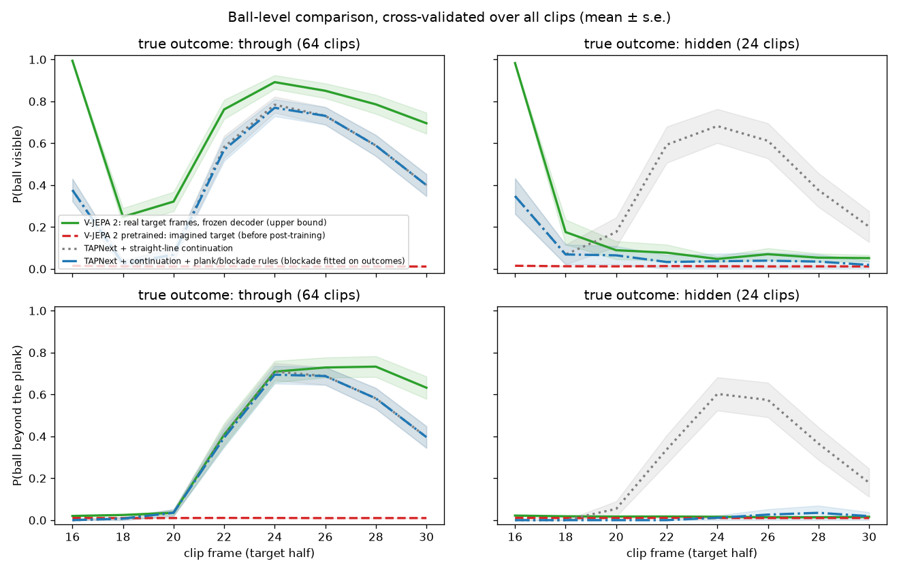

On the earlier `start.mp4` set, the pretrained V-JEPA imagined outcome AUROC was 0.40 (64/64
through passes called hidden), and TAPNext + fitted blockade reached 0.98. That blocker was in a
different place and the clips were easier. **On the current clips the bar is 0.85, not 0.98.**

## 6. My reading of the results

1. **Proof of concept: met for the training direction.**
   - The gain is large and paired: commit +0.43 to +0.59, CI well clear of 0.
   - The readout cannot have learnt it, because the decoder is frozen and outcome-blind.
   - Commit beats the outcome-fitted tracker reference (0.93 vs 0.85).
2. **What it learnt is partial.**
   - It gets one of the two through windows.
   - Its imagined ball past the plank is faint (about 30% of the real strength).
   - It is still improving at epoch 10: 19 of the 20 folds of plain, commit, codes and gate peak
     at epoch 9 or 10. Longer training is the cheapest likely win.
3. **Main open question: blockade or one-direction rule?** The drop on the other side fits
   either of these:
   - (a) a rule tied to motion direction ("right-to-left balls at these heights stop");
   - (b) a real blockade model hurt by distribution shift (mirror-image motion, mostly bounces).

   The mirror test (flip left clips so they look like right-entry) and the height test (score vs
   the fitted blockade range) separate the two:
   - if mirrored-after recovers high AUROC, it learnt something keyed to motion direction;
   - if score vs height tracks the blockade range on left clips, it learnt the location.

## 7. Future work

### Runs not done yet (queued in `docs/experiment_plan.md` / `plan.py`)

| priority | run | why |
|---|---|---|
| 1 | `mirror-plain`, `mirror-commit` (+ height test) | Settles the direction-rule question. Code is in (`975c38c`), about 2 h on Kaggle. |
| 2 | `long-1` / `long-2`: best two × 30 epochs | Best epochs are still 9–10, so the model is likely still improving. |
| 3 | `interpret` for commit (the best run) | So far only plain is interpreted. |
| 4 | `rollout-after`, `codes_rollout-before/after` | Rollout was mid-training when Kaggle stopped (likely weekly quota). |
| 5 | `gate_hyp_commit-after` | Low priority: gate and hyp both failed alone. |
| 6 | `frac-50`, `frac-25` | Does the gain grow with data? Compute-heavy, so last. |
| – | Stage 5 new-ball test | Needs a new-ball recording (`configs/heldout.json`). |
| – | 3-way bounce score with `away_from_plank` | Ready on PR #4. Rescore only, waits for PR #4 to merge. |
| – | "Known blocker" panel | Needs the blocker outline in `configs/scenes/whole.json`. |

### Directions I think are most promising

1. **Counterfactual sweep (cheap, high value).** Paste the ball at many heights in one context
   and plot imagined P(blocked) along the plank. That gives the model's blockade map directly,
   with no outcomes involved. It would show both windows (or not) and works on either side.
2. **Surprise as a second score.** Path-matched surprise already separates outcomes before
   training. If post-training makes the model *less* surprised by blocked passes in the
   blockade rows and not elsewhere, that is label-free evidence of a location-specific model.
3. **Train on both directions.** Then hold out a **moved blocker** recording. This is the clean
   test of "object at a place":
   - a direction rule would fail both;
   - a location model would transfer across directions and adapt quickly to the new position.
4. **Fix the commitment problem properly.** Plain averages the futures; hyp collapsed. Options:
   - hyp with a balanced assignment or an entropy bonus on the picker;
   - **discrete latent modes** (a small VQ "outcome" latent the predictor conditions on, learnt
     self-supervised);
   - an **adversarial** term that makes imagined features look like real ones, which should
     sharpen the faint ball. The discriminator is part of training, not a readout, so it is
     allowed, but it must never see outcome labels.
5. **Object-slot sparsity.** Penalise changes away from ball tokens. The interpretation shows
   the change is spread over the whole frame, and pushing it onto the ball should help transfer.
6. **Imitation-from-observation pick-up policy.** Use the post-trained predictor to imagine
   *where and when* the ball crosses the line, read through the same frozen decoder. That
   forecast is the policy's target.
   - Start with a planner that moves the gripper to the predicted crossing point.
   - Then learn from human demonstration video, e.g. action-conditioned prediction in the style
     of V-JEPA 2-AC.
   - Success metric: pick-up rate on blocked vs through passes. A blockade-aware model should
     not reach for balls that never arrive.
